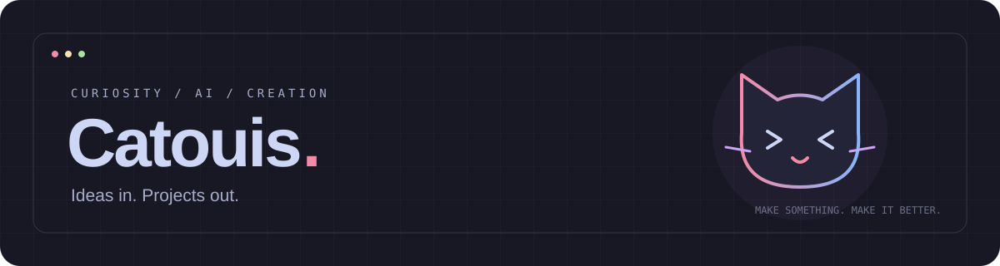

<p align="center">
  
</p>
<p align="center">
  
</p>

## 👋 Hey, I'm Catouis

I turn ideas into projects with AI, curiosity, and a lot of iteration.

- 🧠 **My approach:** describe the idea, build it, try it, make it better.
- 🛠️ **My playground:** AI-assisted development and whatever I feel like building next.
- 🌱 **My mindset:** learning by shipping — one experiment at a time.

## ✨ AI Tools & Workflow

<p>
  
  
  
</p>

```text
💡 idea → 💬 prompt → 🛠 build → 🧪 test → 🚀 ship → ↻ improve
```

## 📊 GitHub Analytics & Streak

<p align="center">
  
  
</p>

## 👾 A Little Progress, Every Day

<picture>
  <source media="(prefers-color-scheme: dark)" srcset="https://raw.githubusercontent.com/nvkdzvcl/nvkdzvcl/main/dist/pacman-contribution-graph-dark.svg" />
  <source media="(prefers-color-scheme: light)" srcset="https://raw.githubusercontent.com/nvkdzvcl/nvkdzvcl/main/dist/pacman-contribution-graph.svg" />
  
</picture>

---

<p align="center"><sub>Ideas in. Projects out. Powered by curiosity and AI.</sub></p>
